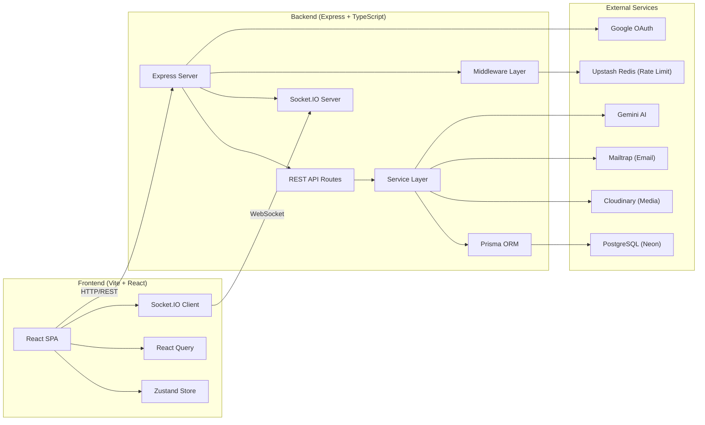
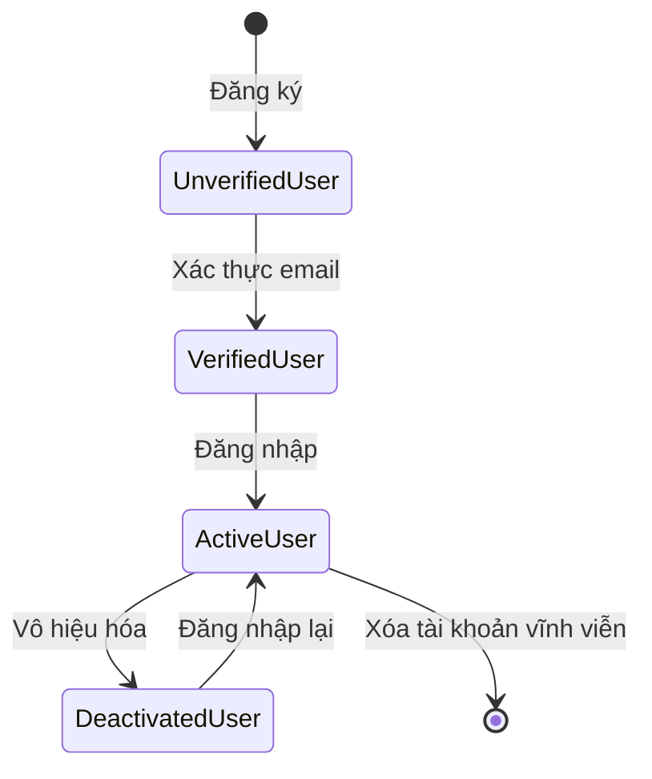
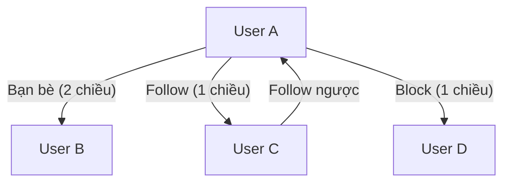
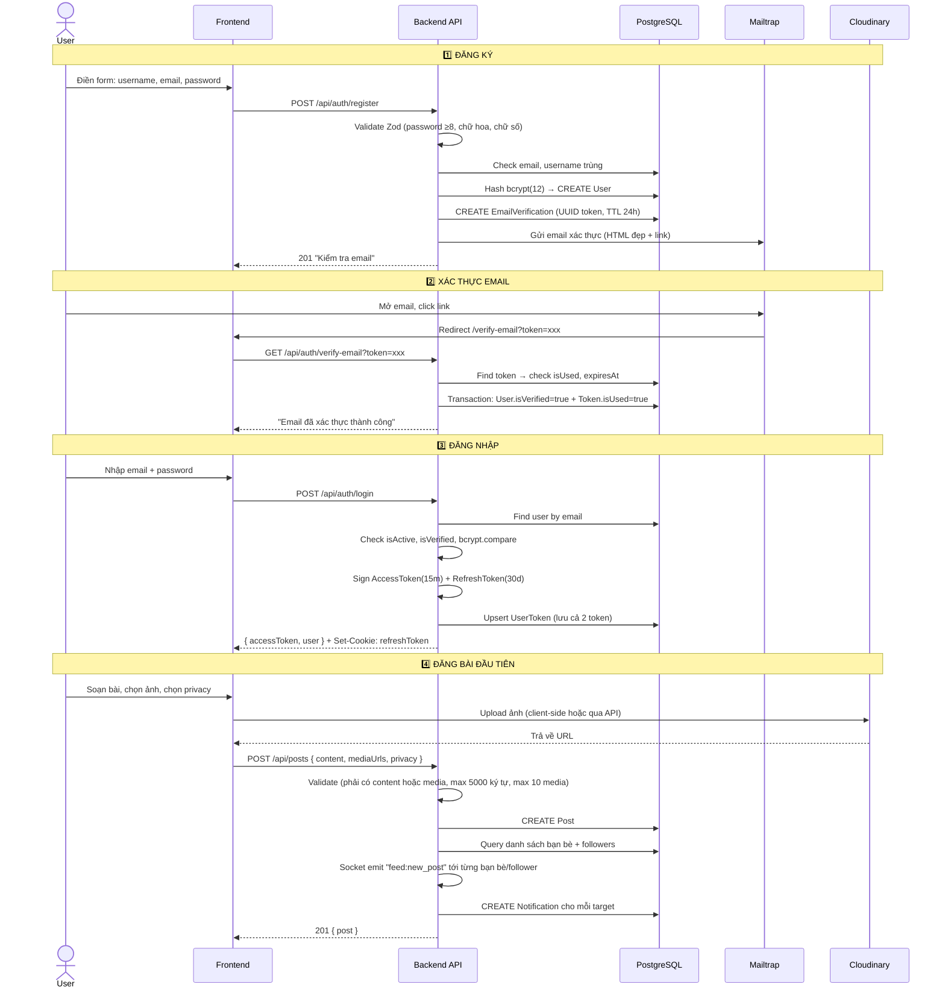
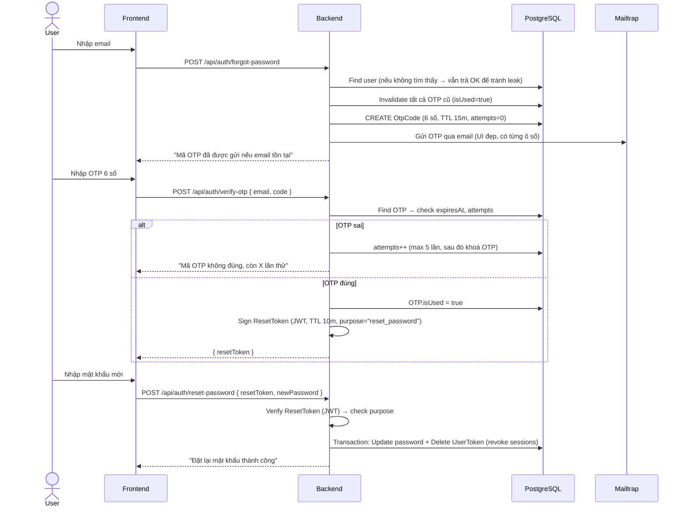
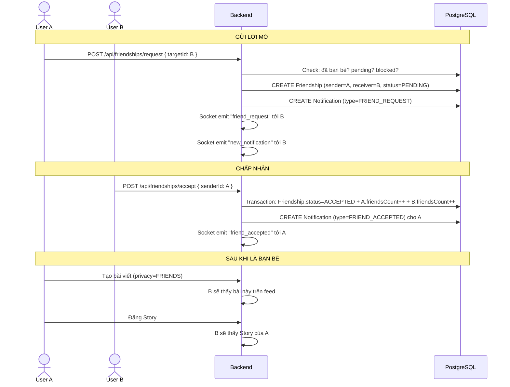
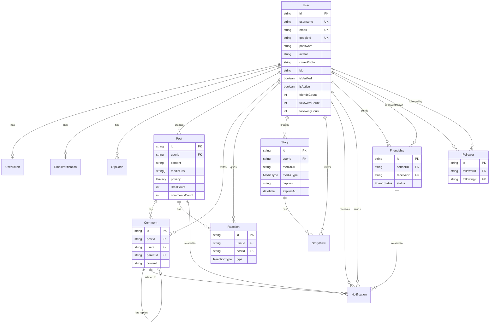
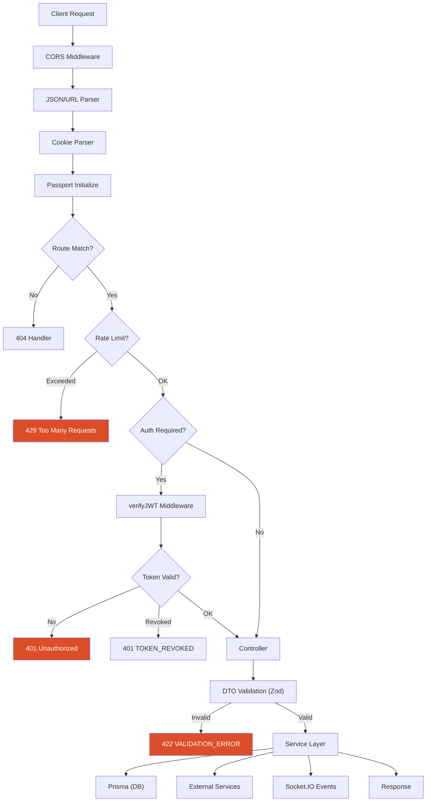
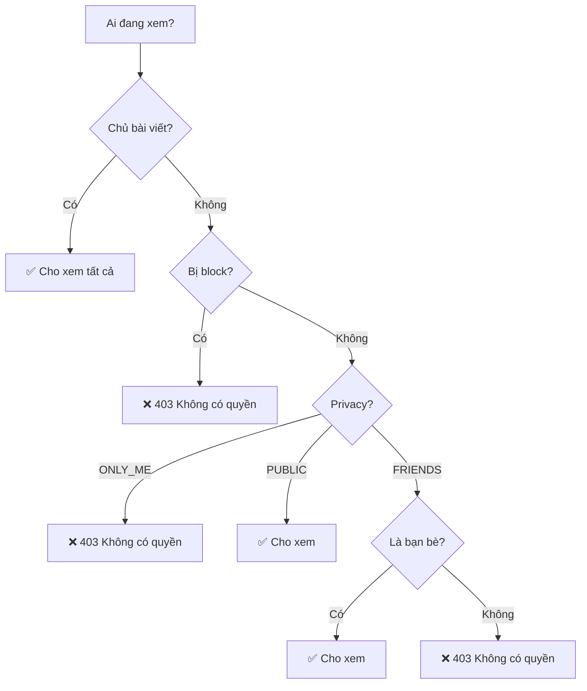
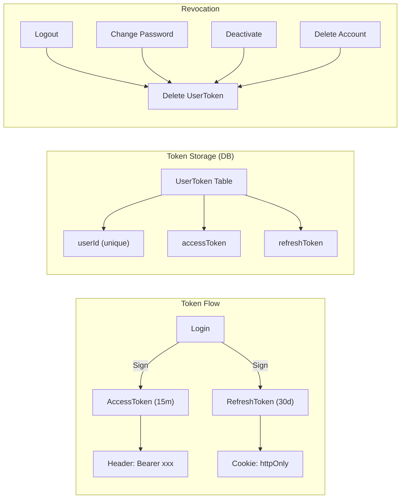

# 📘 Phân Tích Luồng Nghiệp Vụ Hệ Thống — Vire Social Media Platform

> **Ngày phân tích:** 11/04/2026  
> **Phạm vi:** Full-stack (Backend + Frontend + Database + Realtime)

---

## 📑 Mục lục

1. [Tổng Quan Hệ Thống](#1-tổng-quan-hệ-thống)
2. [Actors & Roles](#2-actors--roles)
3. [Luồng End-to-End](#3-luồng-end-to-end)
4. [Phân Tích Tính Năng](#4-phân-tích-tính-năng)
5. [Thiết Kế CSDL & Quan Hệ](#5-thiết-kế-csdl--quan-hệ)
6. [API & Luồng Dữ Liệu](#6-api--luồng-dữ-liệu)
7. [Logic Nghiệp Vụ Cốt Lõi](#7-logic-nghiệp-vụ-cốt-lõi)
8. [Edge Cases & Exceptions](#8-edge-cases--exceptions)
9. [Điểm Yếu / Rủi Ro / Đề Xuất](#9-điểm-yếu--rủi-ro--đề-xuất)

---

## 1. Tổng Quan Hệ Thống

### Vire giải quyết bài toán gì?

**Vire** là một nền tảng mạng xã hội (social media platform) cho phép người dùng **kết nối, chia sẻ nội dung, và tương tác theo thời gian thực** — tương tự như một phiên bản đơn giản hóa của Facebook.

### Các vấn đề cốt lõi được giải quyết:

| Vấn đề | Giải pháp của Vire |
|--------|-------------------|
| Kết nối con người | Hệ thống kết bạn, theo dõi (follow) |
| Chia sẻ nội dung | Đăng bài viết (text + media), story 24h |
| Tương tác xã hội | Reaction (6 loại cảm xúc), bình luận, reply |
| Thông báo real-time | Socket.IO push notification tức thì |
| Kiểm soát quyền riêng tư | 3 cấp độ privacy: Public / Friends / Only Me |
| Hỗ trợ sáng tạo nội dung | AI caption generator (Gemini) |

### Kiến trúc tổng quan:



### Tech Stack chi tiết:

| Layer | Công nghệ |
|-------|-----------|
| **Frontend** | React 19, Vite 8, TypeScript, TailwindCSS 4, Zustand, React Query, Socket.IO Client, React Hook Form + Zod, ShadCN/Radix UI |
| **Backend** | Express 5, TypeScript, Prisma 7 ORM, Socket.IO 4, Passport.js (Google OAuth) |
| **Database** | PostgreSQL (Neon — serverless) |
| **Media Storage** | Cloudinary (upload stream, transform, auto resource type) |
| **Email** | Nodemailer + Mailtrap (sandbox dev) |
| **Rate Limiting** | Upstash Redis (sliding window) |
| **AI** | Google Gemini 2.5 Flash |
| **Validation** | Zod 4 (cả backend lẫn frontend) |
| **Deploy** | Vercel (frontend), server riêng (backend) |

---

## 2. Actors & Roles

Hệ thống hiện tại **không có phân quyền admin/moderator** — chỉ có một loại actor duy nhất là **User** (người dùng thường), với các trạng thái khác nhau:



### Chi tiết các trạng thái:

| Trạng thái | `isVerified` | `isActive` | Quyền |
|------------|-------------|-----------|-------|
| **Chưa xác thực** | `false` | `true` | Không thể đăng nhập, chỉ có thể resend verify email |
| **Đã xác thực** | `true` | `true` | Toàn quyền sử dụng hệ thống |
| **Vô hiệu hóa** | `true` | `false` | Profile ẩn khỏi tìm kiếm, bài viết ẩn. Đăng nhập lại → tự động kích hoạt |
| **Google User** | `true` (auto) | `true` | Như user thường, `password = null`, có `googleId` |

### Quan hệ giữa các User:



| Quan hệ | Tính chất | Ảnh hưởng |
|---------|----------|-----------|
| **Bạn bè** | 2 chiều, cần gửi/chấp nhận | Xem bài FRIENDS, xem Story, gợi ý bạn bè chung |
| **Follow** | 1 chiều, không cần chấp nhận | Xem bài PUBLIC trên feed, nhận thông báo bài mới |
| **Block** | 1 chiều, ẩn hoàn toàn | Không thể xem profile, bài viết, gửi lời mời, follow |

---

## 3. Luồng End-to-End

### 📌 Kịch bản 1: Người dùng mới từ đăng ký đến đăng bài đầu tiên



### 📌 Kịch bản 2: Quên mật khẩu và đặt lại



### 📌 Kịch bản 3: Kết bạn và tương tác



---

## 4. Phân Tích Tính Năng

### 4.1. Authentication & Authorization

| Tính năng | Chi tiết |
|-----------|---------|
| **Đăng ký** | username + email + password, hash bcrypt(12), gửi email verify |
| **Đăng nhập** | Email/password, auto reactivate nếu deactivated, dual JWT |
| **Google OAuth** | Passport.js, auto-create user, auto-verify, auto-merge nếu email đã tồn tại |
| **JWT Dual Token** | Access (15m) + Refresh (30d), lưu trong DB để có thể revoke |
| **Refresh Token** | HttpOnly cookie (`sameSite: none, secure`), endpoint `/api/auth/refresh` |
| **Quên mật khẩu** | OTP 6 số qua email, max 5 lần thử, expire 15m → Reset Token (JWT 10m) |
| **Đổi mật khẩu** | Yêu cầu mật khẩu hiện tại, revoke all sessions |
| **Rate Limiting** | Upstash Redis sliding window: Auth 10 req/15m |

### 4.2. Posts (Bài viết)

| Tính năng | Chi tiết |
|-----------|---------|
| **Tạo bài** | Text (max 5000 ký tự) + media URLs (max 10), phải có ít nhất 1 trong 2 |
| **Privacy** | `PUBLIC` → ai cũng thấy, `FRIENDS` → chỉ bạn bè, `ONLY_ME` → chỉ mình |
| **Feed** | Cursor-based pagination, lọc theo privacy + friendship + follow + block |
| **Sửa bài** | Chỉ chủ bài, chỉ sửa content + privacy (không sửa media) |
| **Xoá bài** | Chỉ chủ bài, xoá media trên Cloudinary, cascade xoá comments/reactions |
| **Real-time** | Emit `feed:new_post`, `post:updated`, `post:deleted` qua Socket.IO |
| **Notification** | Tạo noti `NEW_POST` cho tất cả bạn bè + followers |

### 4.3. Comments (Bình luận)

| Tính năng | Chi tiết |
|-----------|---------|
| **Comment gốc** | Text trên bài viết, tăng `commentsCount` |
| **Reply** | Chỉ hỗ trợ **1 cấp** (reply trên comment gốc, không nested sâu hơn) |
| **Sửa/Xoá** | Chỉ chủ comment, xoá comment gốc → cascade xoá tất cả replies, giảm đúng `commentsCount` |
| **Real-time** | Emit `post:new_comment`, `post:new_reply`, `post:comment_updated`, `post:comment_deleted` |
| **Notification** | `POST_COMMENT` (cho chủ bài), `COMMENT_REPLY` (cho chủ comment gốc) |
| **Cursor** | Sắp xếp ASC (cũ nhất trước) — ngược với feed |

### 4.4. Reactions (Cảm xúc)

| Tính năng | Chi tiết |
|-----------|---------|
| **6 loại** | `LIKE`, `LOVE`, `HAHA`, `WOW`, `SAD`, `ANGRY` |
| **Toggle logic** | Chưa react → tạo mới / Cùng loại → bỏ react / Khác loại → đổi loại |
| **Unique** | `@@unique([userId, postId])` — mỗi user chỉ 1 reaction/post |
| **Summary** | Thống kê theo loại, tổng số, reaction của mình |
| **Real-time** | Emit `post:reaction` với `action: created/updated/deleted` |

### 4.5. Friendships (Kết bạn)

| Tính năng | Chi tiết |
|-----------|---------|
| **Gửi lời mời** | Kiểm tra trùng, không tự gửi cho mình, không gửi khi blocked |
| **Chấp nhận** | Chỉ người nhận mới chấp nhận, tăng `friendsCount` cả 2 bên |
| **Từ chối** | Xoá record Friendship |
| **Huỷ lời mời** | Người gửi self-cancel |
| **Huỷ kết bạn** | Giảm `friendsCount` cả 2 bên |
| **Block** | Chuyển trạng thái, nếu đang là bạn bè → giảm `friendsCount` |
| **Unblock** | Chỉ người block mới unblock, xoá record |
| **Gợi ý bạn bè** | Raw SQL query tính bạn chung (`mutualCount`), loại trừ đã bạn/blocked/pending |

### 4.6. Followers (Theo dõi)

| Tính năng | Chi tiết |
|-----------|---------|
| **Follow** | 1 chiều, không cần đồng ý, tăng `followersCount`/`followingCount` |
| **Unfollow** | Giảm counter tương ứng |
| **Block check** | Không thể follow người bị blocked |
| **Feed impact** | Người follow (không phải bạn bè) chỉ thấy bài `PUBLIC` trên feed |

### 4.7. Stories

| Tính năng | Chi tiết |
|-----------|---------|
| **Tạo story** | Upload file (image/video) qua Multer → Cloudinary, caption max 200 ký tự |
| **Hết hạn** | Auto expire sau 24 giờ (`expiresAt`) |
| **Hiển thị** | Chỉ bạn bè mới xem được story, grouped by user, ưu tiên unread |
| **Lượt xem** | `StoryView` upsert — chủ story không tính lượt xem |
| **Danh sách người xem** | Chỉ chủ story mới xem được |
| **Real-time** | Emit `story:new`, `story:deleted`, `story:viewed` |
| **Media type** | Tự detect `IMAGE`/`VIDEO` từ mimetype |

### 4.8. Notifications

| Tính năng | Chi tiết |
|-----------|---------|
| **Loại** | `FRIEND_REQUEST`, `FRIEND_ACCEPTED`, `POST_REACT`, `POST_COMMENT`, `COMMENT_REPLY`, `NEW_FOLLOWER`, `NEW_POST` |
| **Self-skip** | Không tạo noti nếu `userId === fromUserId` (tự react/comment bài mình) |
| **Đánh dấu đã đọc** | Riêng lẻ hoặc tất cả |
| **Xoá** | Chỉ chủ sở hữu mới xoá |
| **Real-time** | Emit `new_notification` kèm thông tin sender |
| **Cursor pagination** | Lọc thêm theo `unread` |

### 4.9. AI Caption Generator

| Tính năng | Chi tiết |
|-----------|---------|
| **Input** | Mảng URL ảnh (1–10), ngôn ngữ (vi/en) |
| **Processing** | Fetch ảnh → convert base64 → gửi Gemini 2.5 Flash |
| **Output** | 3 caption phong cách khác nhau (cảm xúc, hài hước, truyền cảm hứng) |
| **Format** | JSON structured output `{ captions: [...] }` |

### 4.10. User Profile & Settings

| Tính năng | Chi tiết |
|-----------|---------|
| **Cập nhật profile** | Username (check unique), bio |
| **Avatar** | Upload → Cloudinary (crop 400x400 fill), xoá ảnh cũ |
| **Cover photo** | Upload → Cloudinary (crop 1200x400 fill), xoá ảnh cũ |
| **Vô hiệu hóa** | `isActive=false`, revoke tokens, disconnect socket |
| **Xoá tài khoản** | Xoá toàn bộ: media Cloudinary, cập nhật counter bạn bè/follow, cascade delete |
| **Tìm kiếm** | Theo username (case insensitive), kèm friendship status |

---

## 5. Thiết Kế CSDL & Quan Hệ

### ERD — Entity Relationship Diagram



### Chiến lược đếm (Counter Pattern):

Hệ thống sử dụng **Denormalized Counters** — lưu sẵn số đếm trong bảng chính thay vì `COUNT()` mỗi lần query:

| Model | Counter Fields | Cập nhật khi |
|-------|---------------|-------------|
| `User` | `friendsCount` | Accept/Unfriend/Block/Delete account |
| `User` | `followersCount` | Follow/Unfollow/Delete account |
| `User` | `followingCount` | Follow/Unfollow/Delete account |
| `Post` | `likesCount` | Toggle reaction (create/delete) |
| `Post` | `commentsCount` | Create/Delete comment (root xoá → giảm = 1 + replies count) |

> [!IMPORTANT]
> Tất cả cập nhật counter đều dùng **`$transaction`** để đảm bảo atomicity.

### Indexing Strategy:

| Bảng | Index | Mục đích |
|------|-------|---------|
| `Post` | `[userId, createdAt DESC, id DESC]` | Lấy bài của 1 user (profile) |
| `Post` | `[createdAt DESC, id DESC]` | Feed pagination |
| `Comment` | `[postId, createdAt ASC, id ASC]` | Comments list (oldest first) |
| `Reaction` | `@@unique([userId, postId])` | 1 reaction/user/post |
| `Friendship` | `[receiverId, status, updatedAt DESC]` | Pending requests list |
| `Notification` | `[userId, isRead, createdAt DESC]` | User notification feed |
| `Story` | `[userId, expiresAt]` | Active stories check |

---

## 6. API & Luồng Dữ Liệu

### API Routing Map:

```
/api
├── /auth
│   ├── POST /register            ← Rate limited
│   ├── GET  /verify-email?token=
│   ├── POST /resend-verify        ← Rate limited
│   ├── POST /login                ← Rate limited
│   ├── POST /logout               ← Auth required
│   ├── POST /refresh
│   ├── POST /forgot-password      ← Rate limited
│   ├── POST /verify-otp           ← Rate limited
│   ├── POST /reset-password       ← Rate limited
│   ├── PUT  /change-password      ← Auth + Rate limited
│   ├── GET  /google               ← OAuth redirect
│   └── GET  /google/callback      ← OAuth callback
│
├── /users
│   ├── GET  /me                   ← Auth required
│   ├── PUT  /me                   ← Auth required
│   ├── PUT  /me/avatar            ← Auth + Upload middleware
│   ├── PUT  /me/cover             ← Auth + Upload middleware
│   ├── POST /me/deactivate        ← Auth required
│   ├── DELETE /me                 ← Auth required
│   ├── GET  /search?q=            ← Auth required
│   ├── GET  /username/:username   ← Auth required
│   ├── GET  /:id                  ← Auth required
│   ├── GET  /:id/posts            ← Auth required
│   ├── GET  /:id/followers        ← Auth required
│   ├── GET  /:id/following        ← Auth required
│   └── GET  /:id/stories/active   ← Auth required
│
├── /posts
│   ├── POST /                     ← Auth + Rate limited
│   ├── GET  /feed                 ← Auth required
│   ├── GET  /:id                  ← Auth required
│   ├── PUT  /:id                  ← Auth required
│   ├── DELETE /:id                ← Auth required
│   ├── GET  /:id/comments         ← Auth required
│   ├── POST /:id/comments         ← Auth required
│   ├── GET  /:id/reactions        ← Auth required
│   ├── POST /:id/reactions        ← Auth required
│   └── GET  /:id/reactions/summary ← Auth required
│
├── /comments
│   ├── GET  /:id/replies          ← Auth required
│   ├── POST /:id/reply            ← Auth required
│   ├── PUT  /:id                  ← Auth required
│   └── DELETE /:id                ← Auth required
│
├── /friendships
│   ├── POST /request              ← Auth + Rate limited
│   ├── POST /accept               ← Auth required
│   ├── POST /reject               ← Auth required
│   ├── POST /cancel               ← Auth required
│   ├── POST /unfriend             ← Auth required
│   ├── POST /block                ← Auth required
│   ├── POST /unblock              ← Auth required
│   ├── GET  /requests             ← Auth required
│   ├── GET  /sent                 ← Auth required
│   ├── GET  /friends/:id          ← Auth required
│   ├── GET  /status/:id           ← Auth required
│   └── GET  /suggestions          ← Auth required
│
├── /followers
│   ├── POST /follow               ← Auth required
│   └── POST /unfollow             ← Auth required
│
├── /notifications
│   ├── GET  /                     ← Auth required
│   ├── GET  /unread-count         ← Auth required
│   ├── PUT  /:id/read             ← Auth required
│   ├── PUT  /read-all             ← Auth required
│   └── DELETE /:id                ← Auth required
│
├── /stories
│   ├── POST /                     ← Auth + Upload middleware
│   ├── GET  /feed                 ← Auth required
│   ├── GET  /me                   ← Auth required
│   ├── POST /:id/view             ← Auth required
│   ├── GET  /:id/viewers          ← Auth required
│   └── DELETE /:id                ← Auth required
│
└── /ai
    └── POST /generate-caption     ← Auth required
```

### Request Lifecycle:



### Socket.IO Events Map:

| Event | Direction | Mô tả |
|-------|-----------|-------|
| `user:online` | Server → All | User kết nối |
| `user:offline` | Server → All | User ngắt kết nối (tất cả tab) |
| `presence:check` | Client → Server → Client | Kiểm tra ai đang online (callback) |
| `feed:new_post` | Server → Friends/Followers | Bài viết mới xuất hiện trên feed |
| `post:updated` | Server → Post Room | Bài viết được sửa |
| `post:deleted` | Server → Post Room | Bài viết bị xoá |
| `post:new_comment` | Server → Post Room | Comment mới |
| `post:new_reply` | Server → Post Room | Reply mới |
| `post:comment_updated` | Server → Post Room | Comment được sửa |
| `post:comment_deleted` | Server → Post Room | Comment bị xoá |
| `post:comments_count` | Server → Post Room | Số comment thay đổi |
| `post:reaction` | Server → Post Room | Reaction thay đổi |
| `friend_request` | Server → Target User | Lời mời kết bạn mới |
| `friend_accepted` | Server → Sender | Lời mời được chấp nhận |
| `friend_request_rejected` | Server → Sender | Lời mời bị từ chối |
| `friend_request_cancelled` | Server → Receiver | Lời mời bị huỷ |
| `friend_unfriended` | Server → Both | Huỷ kết bạn |
| `new_notification` | Server → Target User | Thông báo mới |
| `story:new` | Server → Friends | Story mới |
| `story:deleted` | Server → Friends | Story bị xoá |
| `story:viewed` | Server → Story Room | Có người xem story |
| `join_post` / `leave_post` | Client → Server | Tham gia/rời room post |
| `join_story` / `leave_story` | Client → Server | Tham gia/rời room story |

---

## 7. Logic Nghiệp Vụ Cốt Lõi

### 7.1. Feed Algorithm

Feed là **tính năng phức tạp nhất** của hệ thống. Logic xây dựng feed:

```
Feed(myId) = 
    BÀI CỦA MÌNH (tất cả privacy)
  + BÀI CỦA BẠN BÈ (PUBLIC + FRIENDS)
  + BÀI CỦA NGƯỜI FOLLOW (chỉ PUBLIC, nếu không phải bạn bè)
  − BÀI CỦA NGƯỜI BỊ BLOCK (loại hoàn toàn)
```

**Cursor-based Pagination**: Sử dụng composite cursor `(createdAt, id)` thay vì offset để tránh vấn đề khi có bài viết mới xen vào.

```
Mã hoá: base64({ field: createdAt_ISO, id: post_UUID })
Điều kiện: createdAt < cursor.field OR (createdAt = cursor.field AND id < cursor.id)
```

### 7.2. Permission System (Hệ thống phân quyền bài viết)



Hàm `checkPostPermission()` được **tái sử dụng** bởi tất cả module tương tác với post: comments, reactions, view post chi tiết.

### 7.3. Token Management Strategy



> [!NOTE]
> **Access Token được verify 2 lần**: decode JWT signature **VÀ** so khớp với token lưu trong DB. Điều này cho phép **revoke token ngay lập tức** mà không cần chờ expire — một thiết kế rất tốt.

### 7.4. Notification Pipeline

```
Action xảy ra (react, comment, friend request, v.v.)
  ↓
createAndEmitNotification()
  ↓
Check: userId ≠ fromUserId (không tự thông báo)
  ↓
INSERT Notification + Include fromUser info
  ↓
Socket.IO emit "new_notification" tới room `user:{userId}`
  ↓
Frontend nhận → cập nhật unread count + hiển thị toast
```

### 7.5. Media Upload Pipeline

```
Frontend → Multer (memory storage, max 10MB) → Buffer
  ↓
uploadStream() → Cloudinary upload_stream
  ↓
Cloudinary xử lý:
  - Avatar: crop 400x400 fill
  - Cover: crop 1200x400 fill
  - Story image: limit 1080x1920
  - Story video: folder "stories", resourceType "video"
  ↓
Trả về secure_url → lưu DB
  ↓
Khi xoá/thay: extractPublicId() → deleteResource()
```

### 7.6. Friend Suggestion Algorithm

```sql
-- Tìm người dùng có nhiều bạn chung nhất

Bước 1: Lấy danh sách bạn bè của tôi (friendIds)
Bước 2: Loại trừ: tôi, bạn bè, blocked, pending
Bước 3: Raw SQL JOIN:
  - Tìm User u có friendship ACCEPTED
  - Kiểm tra đầu kia của friendship có nằm trong friendIds (bạn chung)
  - GROUP BY u, COUNT bạn chung
  - ORDER BY mutualCount DESC

Fallback: Nếu chưa có bạn bè → trả về random users (loại trừ blocked/pending)
```

---

## 8. Edge Cases & Exceptions

### Xử lý các tình huống đặc biệt:

| Edge Case | Xử lý |
|-----------|-------|
| **Email đã tồn tại khi đăng ký** | 409 "Email đã được sử dụng" |
| **Username trùng** | 409 "Username đã được sử dụng" (register + update profile) |
| **Login với tài khoản deactivated** | Auto reactivate (`isActive = true`) rồi đăng nhập bình thường |
| **Forgot password với email không tồn tại** | Vẫn trả "OTP đã gửi" để **tránh leak email** (anti-enumeration) |
| **Resend verify với email không tồn tại** | Vẫn trả "Đã gửi lại" → **anti-enumeration** |
| **OTP nhập sai 5 lần** | Khoá OTP (`isUsed = true`), buộc gửi OTP mới |
| **OTP hết hạn** | Tự động đánh dấu `isUsed = true` khi phát hiện expired |
| **Nhiều OTP active** | Khi tạo OTP mới → **invalidate tất cả OTP cũ** |
| **Google login với email đã có** | **Auto-merge**: cập nhật `googleId` + `isVerified = true` |
| **Reply vào reply** | 400 "Chỉ hỗ trợ reply 1 cấp" — ngăn nested quá sâu |
| **Xoá comment gốc có replies** | Cascade delete replies, `commentsCount -= (1 + replies.length)` |
| **Tự react/comment bài mình** | Hoạt động bình thường nhưng **không tạo notification** |
| **Block người đang là bạn bè** | Chuyển status → BLOCKED, **giảm friendsCount cả 2** |
| **Unblock** | Chỉ **người block** mới unblock được (không phải người bị block) |
| **Follow người đã block** | 403 "Không thể theo dõi" |
| **Xem story hết hạn** | Query filter `expiresAt > now()` |
| **Chủ story xem story mình** | Không tính lượt xem (skip nếu `userId === viewerId`) |
| **Xoá tài khoản** | Xoá toàn bộ media Cloudinary, giảm counter bạn bè/follow, cascade delete all data |
| **Đa tab/thiết bị** | `onlineUsers = Map<userId, Set<socketId>>` — offline chỉ khi **tất cả tab** ngắt |
| **Socket chưa khởi tạo** | Tất cả emit đều có `try/catch` → silent skip (không crash app) |

### Error Response Format thống nhất:

```json
{
  "error": {
    "code": "VALIDATION_ERROR | APP_ERROR | UNAUTHORIZED | ...",
    "message": "Mô tả lỗi bằng tiếng Việt",
    "details": [{ "field": "email", "message": "Email không hợp lệ" }]
  }
}
```

| Error Handler | HTTP Code | Trigger |
|---------------|-----------|---------|
| `AppError` | Custom (400/403/404/409) | Business logic errors |
| `ZodError` | 422 | Validation failures |
| `Prisma P2002` | 409 | Unique constraint violation |
| `Prisma P2025` | 404 | Record not found |
| `TokenExpiredError` | 401 | JWT expired |
| `JsonWebTokenError` | 401 | JWT invalid |
| Multer/Upload | 400 | File upload issues |
| Unknown | 500 | Unhandled errors |

---

## 9. Điểm Yếu / Rủi Ro / Đề Xuất

### 🔴 Rủi ro nghiêm trọng

| # | Vấn đề | Mô tả | Đề xuất |
|---|--------|-------|---------|
| 1 | **Secrets trong `.env` bị commit** | File `.env` chứa DB URL, JWT secrets, API keys thực — nếu repo public, toàn bộ hệ thống bị compromise | Xoá `.env` khỏi git history (BFG/filter-branch), rotate tất cả secrets, đảm bảo `.env` nằm trong `.gitignore` |
| 2 | **Không có Admin/Moderation** | Không có cơ chế báo cáo, xoá nội dung vi phạm, ban user | Thêm module Admin với role-based access control, report system |
| 3 | **Counter drift risk** | Nếu transaction fail giữa chừng hoặc race condition, counter có thể lệch | Thêm scheduled job reconcile counter, hoặc dùng `COUNT()` cho critical views |

### 🟡 Điểm yếu kiến trúc

| # | Vấn đề | Mô tả | Đề xuất |
|---|--------|-------|---------|
| 4 | **Feed N+1 query** | `getFeed()` thực hiện 3 query riêng (friendships, followers, blocks) trước khi query posts | Sử dụng materialized view hoặc cache friend list trong Redis |
| 5 | **Notification broadcast O(n)** | Khi tạo bài, emit socket + create noti cho **mỗi bạn bè** (vòng lặp + `Promise.allSettled`) | Sử dụng message queue (BullMQ/RabbitMQ) xử lý async |
| 6 | **Không có message/chat** | Chức năng cơ bản của mạng xã hội nhưng chưa có | Thêm module Chat sử dụng Socket.IO đã có |
| 7 | **Story không tự xoá** | `expiresAt` chỉ filter khi query, không thực sự xoá record + media | Thêm cron job (node-cron) xoá expired stories + cleanup Cloudinary |
| 8 | **Không có image upload limit cho post** | Dùng `mediaUrls` (URLs sẵn) chứ không upload qua backend | Rủi ro spam URLs không phải từ Cloudinary; cân nhắc validate domain |
| 9 | **`getSuggestions` dùng raw SQL** | Có thể bị SQL injection nếu params không sanitize đúng | Prisma `$queryRaw` dùng tagged template → an toàn, nhưng cần audit kỹ |
| 10 | **Không có pagination cho friend suggestion** | Hiện tại chỉ trả `limit` results, không có cursor | Thêm cursor-based pagination cho suggestions |

### 🟢 Đề xuất cải tiến

| # | Đề xuất | Ưu tiên | Lý do |
|---|---------|---------|-------|
| 1 | **Thêm Full-text Search** | Cao | Tìm kiếm bài viết theo nội dung (PostgreSQL tsvector hoặc Elasticsearch) |
| 2 | **Soft delete cho posts** | Trung bình | Cho phép khôi phục bài viết đã xoá nhầm |
| 3 | **Media upload qua backend** | Cao | Kiểm soát file size, type, virus scan trước khi lên Cloudinary |
| 4 | **WebSocket authentication refresh** | Trung bình | Hiện tại token hết hạn → socket mất kết nối, không tự reconnect |
| 5 | **Logging & Monitoring** | Cao | Thêm structured logging (Pino/Winston), APM (Sentry), metrics |
| 6 | **Unit/Integration Tests** | Rất cao | Chưa thấy test nào — rủi ro regression rất lớn |
| 7 | **API Versioning** | Trung bình | `/api/v1/...` để dễ nâng cấp sau này |
| 8 | **Image/Video compression** | Trung bình | Tối ưu bandwidth cho mobile users |
| 9 | **Hashtag & Mention** | Trung bình | Tăng discoverability và engagement |
| 10 | **Bookmark post** | Thấp | Cho phép lưu bài viết yêu thích |

### Rate Limiting Configuration hiện tại:

| Loại | Limit | Window |
|------|-------|--------|
| Auth (login, register, etc.) | 10 requests | 15 phút |
| Post creation | 20 requests | 1 phút |
| Comment creation | 30 requests | 1 phút |
| Friend request | 20 requests | 1 giờ |
| File upload | 10 requests | 1 giờ |

> [!TIP]
> Rate limit hiện tại khá hợp lý cho dev/MVP. Khi scale production, nên tinh chỉnh theo behavior analytics thực tế.

---

## 📝 Tổng kết

**Vire** là một dự án mạng xã hội **khá hoàn chỉnh cho mức MVP**, với các điểm mạnh:

- ✅ Kiến trúc module rõ ràng (Route → Controller → Service → Prisma)
- ✅ Real-time communication toàn diện với Socket.IO
- ✅ Privacy system 3 cấp độ
- ✅ JWT dual-token với revocation mechanism
- ✅ Anti-enumeration cho forgot password / resend verify
- ✅ Cursor-based pagination nhất quán
- ✅ AI integration thú vị (caption generator)
- ✅ Validation layer chặt chẽ (Zod)
- ✅ Error handling thống nhất

Và các điểm cần cải thiện:

- ❌ Thiếu test suite hoàn toàn
- ❌ Thiếu admin/moderation system
- ❌ Secrets có nguy cơ bị expose
- ❌ Chưa có message/chat
- ❌ Story expired không tự dọn dẹp
- ❌ Chưa có logging/monitoring
